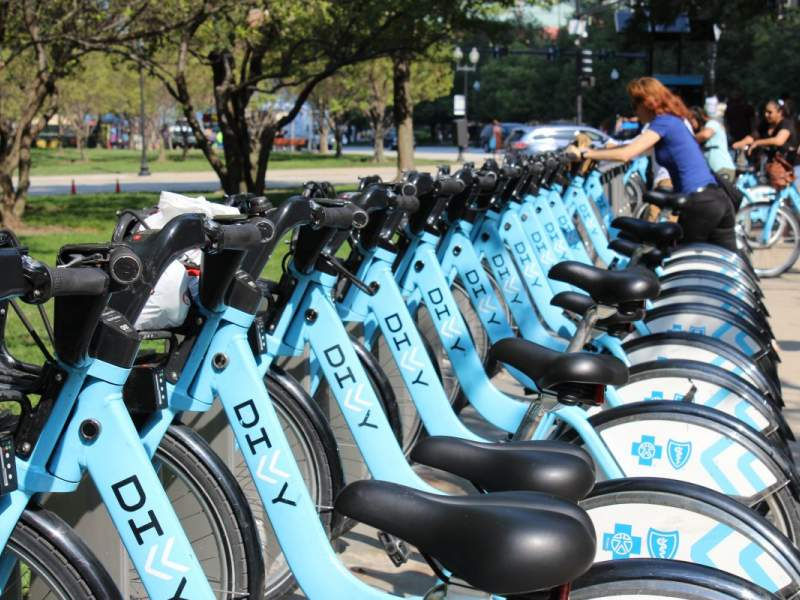

<h1 align="center">
  <br>
  
  <br>
  US Bikeshare
  <br>
</h1>


<h3 align="center"><a href="https://divvybikes.com/" target="_blank">Divvy</a> is a bycle sharing system in the United States: Chicago, New York City and Washington.</h3>


<p align="center">
  <a href="#Description">Description</a> •
  <a href="#how-to-use">How To Use</a> •
  <a href="#download">Download</a> •
  <a href="#credits">Credits</a>
  
</p>


## Description

In this project, I used Python to create a script that takes in raw input to create an interactive experience in the terminial to provide statistics for three major cities in the United States: Chicago, New York City and Washington.

## How To Use

To run this application, You will need the following softwares:
- A text editor like Visual Studio Code, Atom or any text editor of your choice
- A terminal application
 
Running the application should provide an interactive experience like the one shown below

```bash
# Running the application
$ ipython bikeshare.py
Hello Let us explore some US bikeshare data

# Filtering by City
Which city would you like to eplore
Chicago 
Enter a month (e.g May)  or All to apply no filter
February
Please enter any day of the week, e.g Monday or All to apply no filter
Friday

- - - - - - - - - - - - - - - - - - - - - - - - - - - - - - - - - - - - - -

# Output

Calculating The Most Frequent Times of Travel...

The most common month is: February
The most frequent day of the week is: Friday
The most frequent hour is: 17

Calculating The Most Popular Stations and Trip...
```

> **Note**
> If you're using Windows, [see this guide](https://medium.com/@GalarnykMichael/install-git-on-windows-9acf2a1944f0) to Install Git bash or use `terminal` in Linux or Mac.


## Download
More softwares and Libraries used :
- Python3
- Numpy and Pandas

Data was imported as a csv file from:
- [Chicago](https://ride.divvybikes.com/system-data)
- [New York City](https://www.citibikenyc.com/system-data)
- [Washington](https://ride.capitalbikeshare.com/system-data)

## Credits

- Originaly forked from [Udacity’s GitHub Project repository](https://github.com/udacity/pdsnd_github)
- Divvy bicycles Picture source : https://static.wixstatic.com/


